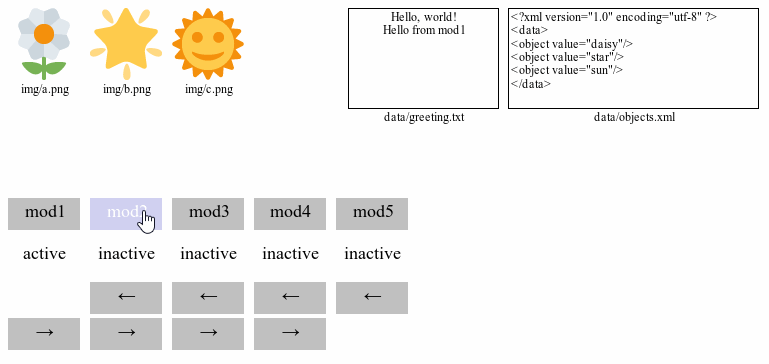
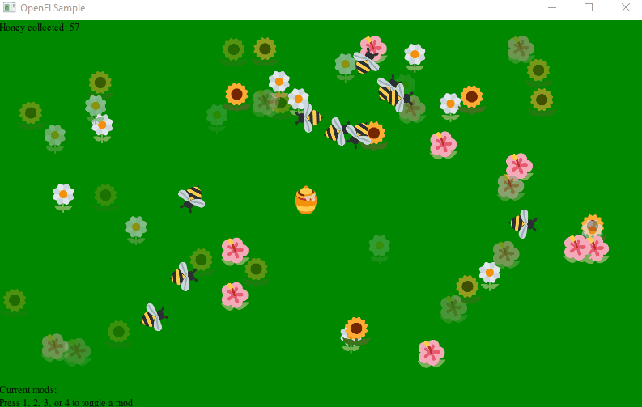

# Polymod
An atomic modding framework for Haxe games/apps.

Supports these frameworks:
- OpenFL
- HEAPS
- NME
- Lime (with or without OpenFL)
- Custom (provide your own backend)
- KHA (Coming Soon)

## Basic sample:


# Contents

- [What is this](#what-is-this)
- [Usage](#usage)
  - [Optional init parameters](#optional-init-parameters)
-  [Creating a mod](#creating-a-mod)
  - [Basic mod structure](#basic-mod-structure)
  - [Metadata](#metadata)
  - [Mod packs](#mod-packs)
- [Scripting](#scripting)
  - [Do it yourself](#do-it-yourself)
  - [Use Polymod's `HScriptable` interface](#use-polymods-hscriptable-interface)
  - [A practical example](#a-practical-example)
- [Best Practices](#best-practices)
  - [For game/app developers](#for-gameapp-developers)
  - [For modders](#for-modders)
- [Further reading](#further-reading)

# What is this

Let's say you have a game or app that you want to make moddable. The easiest way to do this is to:

1. Make your game data-driven (expose as much of your content in the form of loose data files as possible)
2. Let players provide their own data files

Easy enough. But what if you want players to be able to use multiple mods together? How do you manage that?

Polymod solves both problems.

First, it **overrides your framework's asset system** with a custom one pointed at a mod folder (or folders) somewhere on the user's hard drive. Whenever you request an asset via `Assets.getBitmapData()` or `Res.loader.load()` call or whatever, the custom backend first checks if the mod has a modified version of this file. If it does, it returns the mod's modified version. If it doesn't, it falls through to the default asset system (the assets included with the game).

Second, it **combines mods atomically**. Instead of supplying one mod folder, you can provide several. Polymod will go through each folder in turn and apply the changes from each mod, automatically joining them into one combined mod at runtime. Note that this means that the order you load the mods in matters, in the case that they have overlapping changes.

Polymod currently works with [OpenFL](https://www.openfl.org), [lime](https://github.com/openfl/lime), [NME](https://github.com/haxenme/nme), and [HEAPS](https://www.heaps.io) desktop* targets, and will eventually support other frameworks and targets.

\**`sys` target, technically. Any target with a File System.*

Polymod supports the following kinds of operations:
- Replace asset
- Append data to the end of existing asset (text only)
- Merge data at a specified location within an existing asset (text only)

Replace logic works on any asset format.
Append logic works only on text assets.
Merge logic is currently supported for plaintext (TXT), CSV, TSV, and XML asset formats only. Support for JSON is planned.

Samples for the OpenFL, Lime, NME, and HEAPS frameworks are provided.

# Basic Usage

Loading one mod:
```haxe
Polymod.init({
  modRoot:"path/to/mods/",
  dirs:["mymod"]
 });
```

Loading multiple mods:
```haxe
Polymod.init({
  modRoot:"path/to/mods/",
  dirs:["firstmod","secondmod","thirdmod","etc"]
 });
```

> ***NOTE**: On Mac, the default application working directory is `<APPLICATION_NAME>.app/Contents/Resources`, which differs    from Windows and Linux. If you hard code the search path for your game's mod directory, be sure to account for this difference    when targeting the Mac platform.*

Be sure to call `Polymod.init()` before you load any assets. Also note that calling `Polymod.init()` will clear your Asset cache.

After that, you just load your assets as normal:

OpenFL / NME:
```haxe
var myImage = Assets.getBitmapData("myImage.png");
```

Lime:
```haxe
var myImage = Assets.getImage("myImage.png");
```

HEAPS:
```haxe
var myImage = Res.loader.load("myImage.png");
```

This will return either the default asset, or a modified version if it's been replaced by a loaded mod.

## Optional init parameters

At minimum you need to specify your root mod directory and the paths to each individual mod. However, you can also provide the following parameters:

### `apiVersion:String`
This lets you enforce a modding API for your game/app. This is a version string that conforms to [semantic versioning 2.0](https://semver.org/), and if provided will return errors for any mods whose metadata indicates they are not compatible. I strongly recommend you initialize Polymod with this so that users can receive good warnings about which mods may be broken. You should update your game's modding API in accordance with the semantic versioning rules to indicate when you've changed your data format in a way that might introduce breaking changes to existing mods.

### `errorCallback:PolymodError->Void`
This lets you get errors and warnings from Polymod about the mods you're trying to load in. If there's any problems, they'll be reported to this function. Otherwise any failures will happen silently.

### `modVersions:Array<String>`
This is helpful if there's multiple versions of particular mods and you want to check for specific ones. If this array is provided, Polymod will check to see if each mod you attempt to load matches a particular version (as in the mod's own version, not your game/app's modding API version). So if you're trying to load two mods called "foo" and "bar", but you want to make sure "foo" is specifically "foo version 1.2.0", and "bar" is compatible with "bar version 2.3.0", you should pass in `["foo","bar"]` to `dirs` and `["1.2.0","2.3.0"]` to `modVersions`. If any of the mods aren't compatible with the specified version numbers, `errorCallback` will receive them.

### `mergeRules:MergeRules`
If you're using mods that make use of the `_merge` directory, Polymod needs additional information about how to parse certain data formats, CSV files for instance -- are cells quoted or unqouted? You should indicate the particular rules for properly parsing these files in this data structure. Mods just using normal file replacement and the `_append` directory don't need this because neither of those operations requires any knowledge of how to unpack a particular file format and put it back together.

NOTE: Currently this data structure just supports some basic hints for how to parse the CSV data format. More complexity will be added to this as needed.

### `ignoredFiles:Array<String>`
It's common to put some basic metadata files in the root directory of mods, but you might want to keep those from actually winding up as valid assets in the game/app itself. This is also useful for disallowing changes to particular key files. If you define this array, Polymod will not include any file that matches one of these filenames in your final asset library. If you want to exclude Polymod's default recommended metadata files from asset library ingestion, you can call `Polymod.getDefaultIgnoreList()`, which returns these files:

 * `_polymod_meta.json`
 * `_polymod_icon.png`
 * `_polymod_pack.txt`
 * `ASSET_LICENSE.txt`
 * `CODE_LICENSE.txt`
 * `LICENSE.txt`

# Creating a mod

The Polymod format is fairly simple -- create a folder for your mod, and stick some files in it. These files will then either replace or modify files from the base asset set. You have three basic operations:

* Replace: provide files to replace the default ones
* Append: add some lines of text to the end of an existing text file
* Merge: insert some text in the middle of an existing text file, according to specified pattern matching

## Basic mod structure

- root folder
- `_append` folder
- `_merge` folder

### Root folder

Any files you place here will replace those found in the default asset library. So if the default asset library has a file called `graphics/apple.png`, you can provide your own version by placing it at `<modroot>/graphics/apple.png`.

When loading multiple mods, if several mods all provide the same file, the last one loaded will provide the final asset. You can see this behavior in the included sample. This is why the order in which you load mods matters!

### `_append` folder

Any text files you place here will have their contents appended to the ends of files with the same names in the default asset library. So if the base game has a file called `text/hello.txt` that says:

`Hello, world!`

You can add additional lines by placing a file at `<modroot>/_append/text/hello.txt` that says:

`Hello from my mod!`

Which will result in this in game when `text/hello.txt` is loaded and displayed:

```
Hello, world!
Hello from my mod!
```

### `_merge` folder

This is mostly meant for XML and CSV/TSV files. Say you have a big complicated XML file at `data/stuff.xml` with lots of nodes:

```xml
<?xml version="1.0" encoding="utf-8" ?>
<data>
   <!--lots of complicated stuff-->
   <mode id="difficulty" values="easy"/>
   <!--even more complicated stuff-->
</data>
```

And you want it to say this instead:

```xml
<?xml version="1.0" encoding="utf-8" ?>
<data>
   <!--lots of complicated stuff-->
   <mode id="difficulty" values="super_hard"/>
   <!--even more complicated stuff-->
</data>
```

Basically we want to change this one tag from this:

```xml
<mode id="difficulty" values="easy"/>
```

to this:
```xml
<mode id="difficulty" values="super_hard"/>
```

This is the file you would put in `<modroot>/_merge/data/stuff.xml`:
```xml
<?xml version="1.0" encoding="utf-8" ?>
<data>
    <mode id="difficulty" values="super_hard">
        <merge key="id" value="difficulty"/>
    </mode>
</data>
```

This file contains both data and merge instructions. The `<merge>` child tag tells the mod loader what to do, and will not be included in the final data. The actual payload is just this:

```xml
<mode id="difficulty" values="super_hard">
```

The `<merge>` tag instructs the mod loader thus:

* Look for any tags with the same name as my parent (in this case, `<mode>`)
* Look within said tags for a `key` attribute (in this case, one named `"id"`)
* Check if the key's value matches what I'm looking for (in this case, `"difficulty"`)

As soon as it finds the first match, it stops and merges the payload with the specified tag. Any attributes will be added to the base tag (overwriting any existing attributes with the same name, which in this case changes values from "easy" to just "super_hard", which is what we want). Furthermore, if the payload has child nodes, all of its children will be merged with the target tag as well.

CSV and TSV files can be merged as well, but no logic needs to be supplied. In this case, the mod loader will look for any rows in the base file whose first cell matches the same value as those in the merge file, and replace them with the rows from the merge file.

TODO: Merge logic for JSON is currently planned but not yet supported.
TODO: Advanced merge logic for CSV/TSV (specify a field other than the one at index 0 as the primary merge key) is not yet supported.

## Metadata

The only metadata file that is required is `_polymod_meta.json`, and it will look something like this:

```json
{
	"title":"Daisy",
	"description":"This mod has a daisy",
	"author":"Lars A. Doucet",
	"api_version":"0.1.0",
	"mod_version":"1.0.0-alpha",
	"license":"CC BY 4.0,MIT"
}
```

These files are not required, but are strongly recommended:

* `_polymod_icon.png` (for use in mod browsers, etc)
* `LICENSE.txt` (for general licensing terms)
* `ASSET_LICENSE.txt` (for asset-specific licensing terms, I recommend something from [Creative Commons](https://creativecommons.org/))
* `CODE_LICENSE.txt` (for code/script-specific licensing terms, I recommend something like [MIT](https://opensource.org/licenses/MIT))

And this file indicates that the mod is a mod pack:

* `_polymod_pack.txt`

## Mod packs

If a mod includes the file `_polymod_pack.txt` in the root directory, it will be treated not as a regular mod, but as a *mod pack*, ie, a collection of mods. This text file is a simple comma-separated list of mod directory names (relative to the root mod directory).

**NOTE:** *If a mod contains a mod pack list, ALL other files will be ignored.*

Let's say you have a mod called `stuff` that contains this `_polymod_pack.txt`:

`foo,bar,abc,xyz`

Loading `stuff` will cause Polymod to load those four mods in the specified order.

You can also indicate specific versions of mods:

`foo:1.0.0,bar:1.2.0`

As well as use wildcards:

`foo:1.*.*,bar:1.2.*`

When Polymod tries to load a modpack, it will look in the root mod directory you provided for the indicated mods. It will only load mods that 1) actually exist and 2) pass the version check (if specified). Any errors or warning will be sent to the error callback handler, and only non-failing mods will be loaded.

# Scripting



"Okay," you say, "I can replace all the assets I want, but how do I override the base game's code?"

There are two ways to support scripting using Polymod:

1. Do it yourself
2. Use Polymod's `HScriptable` interface

## Do it yourself
You don't need a dedicated scripting framework to get moddable scripts. So long as your script files are part of your asset library, they can be replaced or modified like any other text file, and it doesn't even matter what scripting language you choose. This is a potential [footgun](https://en.wiktionary.org/wiki/footgun) for newcomers, however, so unless you already know what you're doing, I generally recommend using Polymod's built-in support for scripting.

## Use Polymod's `HScriptable` interface
Polymod provides an optional interface called `HScriptable` that will use some macro magic to automatically bind targeted functions to [hscript](https://github.com/HaxeFoundation/hscript) scripts.

_NOTE: Big thanks to [Jeff Ward](https://github.com/jcward) for making this possible!_

There are three steps to enable hscript bindings with Polymod:

### 1. Create a class that implements `HScriptable`
```haxe
class MyClass implements polymod.hscript.HScriptable
```
This class should include some functions you intend to expose to hscript files.

### 2. Tag a function with the `@:hscript` metadata
```haxe
@:hscript
private function doSomething() { }
```

### 3. Provide an hscript file matching the function's module & name:
```
data/demo/Simulation/doSomething.txt
```

The default root search path for scripts is the top-level "data" folder in your assets library. You can change this by modifying the public static variables in `polymod.hscript.HScriptConfig`. Be sure to do this *before* instantiating any class that implements `polymod.hscript.HScriptable`! You can also toggle whether to use the function's fully qualified path as a directory prefix (this behavior is on by default). In this example, the file path `demo/Simulation/doSomething` corresponds with the function's fully qualified path in the Haxe namespace, `demo.Simulation.doSomething`. The casing from your code is reflected in the search path, so be aware of that on case-sensitive file systems (hello Linux!).

**NOTE:** _as of right now the file extension it looks for is ".txt". We plan on making this configurable in the near future._

When you do all of the above steps, "doSomething.txt" will be parsed during `MyClass`'s constructor, and when `MyClass.doSomething()` is run, the parsed hscript representation of `doSomething.txt` will be executed.

## A practical example

We shall use as our example the `openfl_hscript` sample included with Polymod, depicted above. For context, this is a simple simulation containing a field of flowers, some honeybees, and a "home" depicted by a honeypot. Bees will seek out flowers, drain them of pollen, return home, deposit the pollen as honey (updating the score), and then seek a new flower. We would like to expose various aspects of this behavior to scripts, so that users can change the behavior.

First, note that the `Simulation` class implements `HScriptable`:
```haxe
class Simulation extends Sprite implements polymod.hscript.HScriptable
```

### Simple function

Consider this function:
```haxe
@:hscript
private function emptyFlower(flower:Flower) { }
```

And the corresponding hscript file `emptyFlower.txt`:
```haxe
flower.pollen = 0;
flower.cooldown = flower.maxCooldown;
flower.alpha = 0.25;
```

For context, this function runs when a bee visits a flower, touches it, and gains pollen. The default script will remove pollen from the flower, start a cooldown timer, and make it appear faded to indicate that it's depleted.

Note that the function body is empty. The macro will inject all the necessary boilerplate to load the `emptyFlower.txt` script file during the `Simulation` class's constructor, and at runtime when `emptyFlower()` is called, the `flower:Flower` parameter will be passed in to the script as a local variable. So the final `emptyFlower()` function post macro-injection actually looks something like this:

```haxe
private function emptyFlower(flower:Flower)
{
	var script:Script = _polymod_scripts.get("emptyFlower");  //_polymod_scripts initialized in the constructor
	script.set("flower", flower);
	script.execute();
}
```

### Resolving other variables

Here's another function:
```haxe
private function updateBee(bee:Bee, elapsed:Float) { }
```

It only takes two variables, so this should be simple, right?

Well, not so fast:
```haxe
if(bee == null) return;

if(bee.x < 0 || bee.x > 800 || bee.y < 0 || bee.y > 480)
{
    bee.x = 100 + Math.random() * 700;
    bee.y = 50 + Math.random() * 380;
}

if(bee.pollen > 0)
{
    if(!isTouching(bee, home))
    {
        moveToward(bee, home, elapsed);
        if(isTouching(bee, home))
        {
            home.honey += bee.pollen;
            bee.pollen = 0;
            updateScore(home.honey);
        }
    }
    return;
}

if(bee.flower == null)
{
    bee.turnsSearching++;
    bee.flower = getRandomFlower();

    if(bee.flower != null && bee.flower.pollen == 0)
    {
        bee.flower == null;
    }

    if(bee.turnsSearching > 2)
    {
        bee.flower = getRandomFlower();
        bee.turnsSearching = 0;
    }

    if(bee.flower != null && bee.flower.pollen > 0)
    {
        bee.turnsSearching = 0;
    }
}

if(bee.flower != null)
{
    moveToward(bee, bee.flower, elapsed);
    if(isTouching(bee, bee.flower))
    {
        if(bee.flower.pollen > 0)
        {
            bee.pollen = bee.flower.pollen;
            emptyFlower(bee.flower);
        }
        bee.flower = null;
    }
}
```

That logic is relying on many other class member variables, and even calling other functions. This is a pretty common situation when you're trying to convert existing functions into hscript files, and it's not necessarily a good idea to "fix" the problem by cramming all those references in as explicit function parameters. Not only is that unwieldy, it will change the function signature, requiring you to track down every call to this function and update it. Not only is that a pain, it's an opportunity to introduce new bugs.

Instead, you can just add extra variables to the script context, like this:
```haxe
@:hscript(Math,bee,elapsed,home,moveToward,isTouching,getClosestFlower,getRandomFlower,emptyFlower,updateScore)
private function updateBee(bee:Bee, elapsed:Float) { }
```

Here the script will receive all the parameters we specified between the `@:hscript` tag's parentheses, followed by all the normal function parameters. This is also a good way to pass in global utility classes that are otherwise not available to your scripts, such as `Math`, `Std`, and `StringTools`.

**NOTE:** _Although your scripts can make changes to any mutable objects you pass in, a local variable within an hscript file is *not* the same as the local variable from your host function with the same name, even if they both *point* to the same object. This means that you can do `bee.pollen = 0` in your script and expect to see that change even after the script is finished, but if you do `bee = anotherBee` within the script, the `bee` variable in your main function will remain unchanged. Does that make sense? This can be a common source of subtle bugs if you're not careful. TL;DR -- go ahead and use your scripts to change the internal state of objects, call functions, and do calculations, but be very careful about trying to use scripts to change what variables are pointing to._

### Mixing code and scripts

I should note that the function body of a scriptable function doesn't have to be empty!

```haxe
 @:hscript
private function updateScore(value:Float)
{
    score.text = script_result;
}
```

The actual script is a simple one-liner:
```haxe
"Honey collected: " + value;
```

The script simply composes a string, and the function takes the result and updates a text field.

What makes this work is that the macro automatically injects the script logic at the beginning of the `@:hscript`-tagged function, before any other code in the function body. Then it defines two new local variables: `script_result` and `script_error`, both of type `Dynamic`. In this particular function, we feed `script_result` into `score.text`.

**NOTE:** _If your function returns something other than `Void`, the macro will inject a `return script_result;` line at the end of your function, *after* any code you supply. If you want to return something other than `script_result` with your own logic,  be sure to provide your own `return` line to force an early return that skips the macro's injected one._

### Handling errors

If you're exposing scripts in your project, that means someone can change the game's logic at runtime, which means they can and will screw something up, which means *errors*.

You probably want your application to handle them gracefully, or at least give the user some feedback about what went wrong.

```haxe
@:hscript(Std, Math, numFlowers, numBees, distTest, makeFlower, makeHome, makeBee, home)
private function init():Void
{
    if (script_error != null)
    {
      	trace('hscript failed to load or threw: '+script_error);
        trace('TODO: Do something to recover from this failure.');
    }
}
```

As mentioned before, the macro will inject a local `script_error` variable along with the rest of the boilerplate. If there was a problem with the script (typically: it couldn't load, or the script itself threw an error), this variable will be set. Note that there is no point in using your own try/catch block; the macro has already done that for you and caught the result, which is now stored in `script_error`. If `script_error` is null it can be safely ignored.

Handling errors at all is purely optional, but recommended.

# Best Practices

## For game/app developers

### 1. Loose, flat files

Mods work best when modders can rely entirely on replace and append logic. The easiest way to facilitate this is to leave files separated out one by one rather than all glommed together. For instance, it's way easier to replace just one character sprite if each character sprite sheet is its own file, rather than all of them being packed together in one. Although a modder can easily copy and paste the packed file, make a change, and add it to their mod as a replacement, this becomes fragile in two ways:

1. If the base game updates that file (say parts other than what the modder changed), the mod will now have an old version of it, even though they only intended to modify one part of it.
2. If two modders want to change different in-game objects that reside in the same file, and they both use replace logic, their changes will override each other and only one will be resolved in the final asset set.

Of course, for performance reasons developers will often combine files, so there's some tension here. However keep in mind that the OpenFL Asset Library is a kind of *virtual file system*. The default asset library provides a nearly one-to-one mapping between asset names and actual files on disk, but there's no reason you couldn't override your default asset library with say, an asset library that stores everything on disk in one single binary (even encrypted!) PAK file or whatever, while still exposing a nice list of individual asset names. Polymod doesn't care how your actual assets are stored and loaded from disk.

### 2. Texture packs

Most texture packs will provide metadata that allows the original image frames/files to be extracted from a packed file, which in its own way is a tiny virtual file system. You might consider modifying your game/app code to first look for a given asset stored in its own loose file (in case a modder has provided one), before looking in your texture atlas cache.

### 3. Data tables

Data tables and other "flat" file formats can work very well with atomic modding, particularly with append logic. If adding new items or enemies is as simple as adding a new line to a spreadsheet, this is ideal for modders who want to create mix-and-matchable content.

### 4. Publish a modding API, adhere to Semantic Versioning

As soon as your game is ready for modding, you should publish a modding API for your game that tells players what they can expect to modify and how, as well as an associated Mod API version. Don't forget to adhere to [Semantic Versioning 2.0](https://semver.org/), which is summarized thus:

    Given a version number MAJOR.MINOR.PATCH, increment the:

    MAJOR version when you make incompatible API changes,
    MINOR version when you add functionality in a backwards-compatible manner, and
    PATCH version when you make backwards-compatible bug fixes.

### 5. Use the error handler

You should pass in an error handler during initialization and then *use it*, ideally piping useful feedback to your players so that they can debug their mods and make sure they're properly formatted.

### 6. Data-driven design

A game that is mod friendly is heavily data-driven. IE, rather than hard-coding your list of enemy types, make it a text file that you load in at runtime. This way players can define their own types by simply adding new entries to the list.

### 7. Support scripting

Certain parts of your code, such as basic game logic, AI routines, formula calculations, etc, can be exposed to modding via scripts -- human-readable code interpreted at runtime. Polymod can support any scripting language in theory, but we strongly recommend [hscript](https://github.com/HaxeFoundation/hscript) for Haxe games. See the [Scripting](#scripting) section for more details.

If you do so, you should document a list of methods and properties exposed by your scripting system, and publish these along with your default asset manifest as your game's modding API

I might eventually add support for targetted merge logic for hscript files (allowing you to selectively replace e.g. function calls by name) but as of right now no such thing exists. To best support modders, stick to simple script files.

### 8. Encourage generic ids as merge keys

If you look at the sample mod represented by the GIF at the top of this page, you'll notice a slight "bug" of sorts. The base app has three images, a sun, a moon, and a star, and an XML file with tags like `<object value="sun"/>` to match. Notice that when activating mods 1-3, each one replaces one of the graphics with a different kind of flower, and updates the xml tags to match. The mods are using file replace logic for the images, and merge logic for the xml file.

But, notice what happens when mod 4 is activated. Mod 4 replaces the entire XML file so that the xml nodes have values "pineapple", "apple", and "bread". Notice that when Mod 4 is moved into load position 1 and the other mods are activated, the flowers replace the image assets, but they don't properly update the XML data. That's because the replace logic targets the same filenames ("a.png", "b.png", "c.png"), but the merge logic is keyed off of the specific value names ("sun", "moon", "stars"). So when the value names are changed, mods that depend on those specific values as merge keys will not act as intended.

If this file structure had been designed so that each `<object>` tag had a generic key like `<object id="0" value="sun"/>`, and the mods were written to replace based on the unchanging key (`id="0"` instead of `object="sun"`), then these mods would work as intended.

## For modders

### 1. Start simple

Don't try to do too much too fast. Start with something basic, like replacing a single loose image, or adding a line of text somewhere. Don't try to change too much at once -- make one small edit, then test your mod to see how it's working. You can build up steady momentum this way as you build familiarity with both modding in general and the game's specific data set.

### 2. Include a license

If your mod doesn't include a license, it's in a legal gray area. By default, anything you create is automatically your copyright (in the USA at least), and in the absence of a license the assumption is that it's "all rights reserved" -- ie, nobody's allowed to use it any way you haven't specifically permitted.

It gets even worse if other people want to include your mod in theirs, or build off of it. To foster a collaborative modding community, I strongly recommend using open licenses such as these:

[Creative Commons Attribution 4.0](https://creativecommons.org/licenses/by/4.0/) -- for assets and data, etc.
[MIT License](https://opensource.org/licenses/MIT) -- for code/script files, etc.

### 3. It doesn't have to be big

Some of the best mods are simple ones that just do one thing. Since Polymod lets you combine multiple mods easily, it can be nice to just make a few small mods rather than one big one. You can always create a modpack to link multiple atomic mods together, after all.

### 4. Don't over-rely on merge logic

Merge logic is the most complicated, least flexible, and most error prone of the three supported operations. If the developer has structured their game well, you should be able to get most of your work done with just append and replace logic. You should save merge logic only for problems you can't solve any other way.

# Further reading

https://www.fortressofdoors.com/player-friendly-atomic-game-modding/

# TODO:

## Security

Players modifying their games to accept random untrusted third party content are already exposing themselves in a fundamental way, but there's perhaps some things we can do to shave the attack surface area down a bit. For one, special care needs to be taken if some of the assets you're loading via Polymod are driving in-game scripts and have access to e.g. File read/write/delete API's (or even worse, invoking system commands and/or launching other executables). At the moment, Polymod does absolutely nothing to protect you from this, so you must make your own safeguards. In the future we might provide some basic sandboxing or safety checks.
